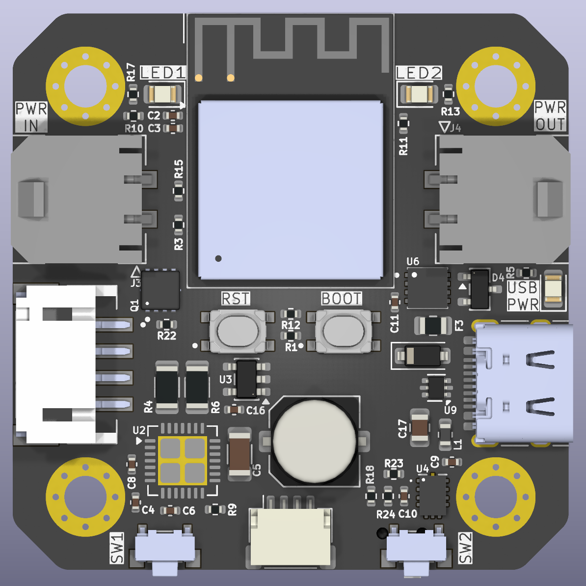
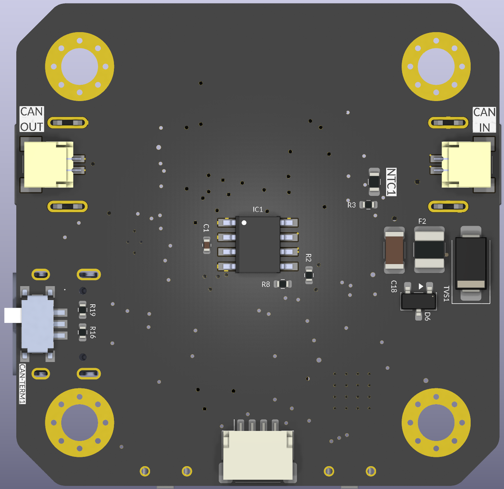

# ⚡ CANBUS-Stepper

<p align="center">
  <b>ESP32-S2 Based Closed-Loop CAN Bus Stepper Motor Driver Board</b>
</p>

<p align="center">
  <a href="#-development-status">Development Status</a> •
  <a href="#-overview">Overview</a> •
  <a href="#-hardware-features">Hardware Features</a> •
  <a href="#-pcb--hardware-preview">PCB Preview</a> •
  <a href="#-sponsorship--support">Sponsorship</a> •
  <a href="#-license--commercial-use">License</a>
</p>

---

## 🚧 Development Status

> [!WARNING]
> **Work In Progress (WIP)**: This project is currently in active **schematic design & PCB layout stage**. 
> The board **has NOT yet been physically manufactured or field-tested**. The schematics and component placements may undergo further design revisions before initial prototype batch production and physical hardware validation.

---

## 📌 Overview

**CANBUS-Stepper** is an open-source, high-performance smart stepper motor driver board built around the **ESP32-S2** microcontroller. Designed specifically for 3D printer toolheads, robotic actuators, and CNC automation, this board integrates a native CAN Bus transceiver (TCAN1044V), magnetic position encoder feedback (AS5600), power regulation (MP2315 buck converter), and stepper motor driving into a compact NEMA 17 footprint.

---

## 🛠️ Hardware Features

- **Microcontroller**: ESP32-S2 (Single-core Xtensa LX7 @ 240MHz, Native USB 2.0, TWAI / CAN Bus support).
- **CAN Bus Transceiver**: TCAN1044VDDFRQ1 5V CAN Transceiver with high ESD and bus fault protection.
- **Power Management**: MP2315GJ High-efficiency step-down buck converter (Wide DC input voltage range).
- **Position Feedback**: AS5600 Magnetic Rotary Encoder (I2C interface) for accurate absolute angle sensing and closed-loop control.
- **Connectivity & I/O**:
  - USB Type-C receptacle for programming, flashing, and serial debugging.
  - Molex Micro-Fit 3.0 & JST connectors for CAN Bus power/data and motor phase outputs.
  - SPDT Slide switches for boot mode and power control.

---

## 🖼️ PCB & Hardware Preview

<p align="center">
  
  &nbsp;&nbsp;
  
  <br>
  <i>Figure 1: CANBUS-Stepper PCB Component Layout Preview — Top Side (Left) & Bottom Side (Right)</i>
</p>

---

## 💖 Sponsorship & Support

To bring this open-hardware project from design files to physical prototype boards, test hardware, and community adoption, **sponsorship and hardware support are warmly welcomed!**

If you are a **PCB manufacturing house, component supplier, or individual backer** interested in supporting:
- 🛠️ **Prototype PCB Fabrication & Assembly (PCBA)**
- 🧪 **Component Sourcing & Hardware Testing**
- ☕ **Developer Contributions & Project Funding**

Please feel free to reach out, open an issue, or sponsor through **GitHub Sponsors**. Your support directly accelerates physical prototyping and open-source hardware validation!

---

## 📁 Repository Structure

```
CANBUS-Stepper/
├── README.md                      # Main project documentation
├── LICENSE                        # Creative Commons CC BY-NC-SA 4.0 License
├── .gitignore                     # Git ignore rules for KiCad and build outputs
├── docs/
│   └── assets/                    # Board renders, diagrams, and documentation assets
├── pcb/                           # KiCad PCB Hardware Design Files
│   ├── canbus-stepper.kicad_pro   # KiCad Project file
│   ├── canbus-stepper.kicad_sch   # Schematic diagram
│   ├── canbus-stepper.kicad_pcb   # PCB Layout
│   ├── sym-lib-table              # Symbol library table
│   ├── fp-lib-table               # Footprint library table
│   ├── *.kicad_sym                # Custom symbol libraries (AS5600, TCAN1044, MP2315, etc.)
│   ├── CANBUS-Stepper.pretty/     # Custom footprint library
│   ├── 3dmodels/                  # Component 3D STEP models for KiCad rendering
│   └── bom/                       # Bill of Materials & Interactive HTML iBOM (ibom.html)
├── firmware/                      # ESP32-S2 Stepper Driver Firmware
│   └── README.md                  # Firmware architecture & CAN bus protocol roadmap
└── step/                          # Board 3D CAD STEP Files
    └── README.md                  # Exported overall PCB 3D STEP model for mechanical integration
```

---

## 🔧 Getting Started

### Opening the PCB Project in KiCad

1. Download and install [KiCad 7.0 or later](https://www.kicad.org/).
2. Clone this repository:
   ```bash
   git clone https://github.com/your-username/CANBUS-Stepper.git
   cd CANBUS-Stepper
   ```
3. Open `pcb/canbus-stepper.kicad_pro` inside KiCad.
4. To view the Interactive Bill of Materials, open `pcb/bom/ibom.html` in any web browser.

---

## 📜 Firmware Roadmap

Firmware development for the ESP32-S2 is structured under `firmware/`. Key roadmap milestones include:
- **TWAI CAN Bus Protocol**: Standardized command set for motor movement, status telemetry, and configuration.
- **Closed-Loop Control**: AS5600 encoder feedback loop for stall detection and precise step regulation.

---

## ⚖️ License & Commercial Use

This project is licensed under the **[Creative Commons Attribution-NonCommercial-ShareAlike 4.0 International (CC BY-NC-SA 4.0)](LICENSE)**.

### 👥 For Individual & Educational Users (Bireysel ve Eğitimsel Kullanım)
- **100% Free and Open**: You are free to view, modify, build, and use this hardware design and code for personal projects, research, education, and non-commercial applications.

### 🏢 For Commercial Use & Manufacturing (Ticari Kullanım ve Üretim)
- **Commercial Restriction**: Producing, selling, or deriving commercial products from this design without explicit written authorization from the copyright holder is strictly prohibited.
- **Dual Licensing**: If you wish to manufacture, integrate, or sell boards based on this design commercially, please contact the repository owner to obtain a commercial license.
