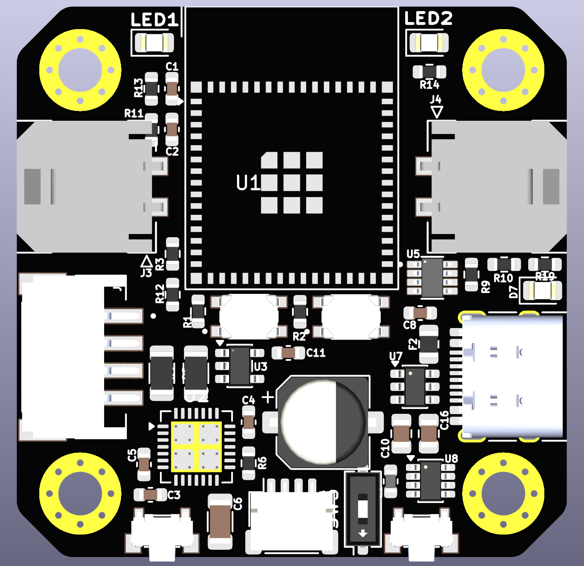
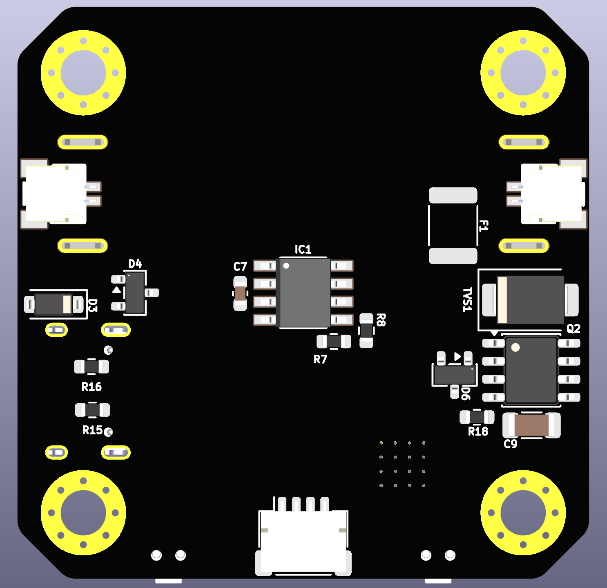

# ⚡ CANBUS-Stepper

<p align="center">
  <b>ESP32-S2 Based Closed-Loop CAN Bus Stepper Motor Driver Board</b>
</p>

<p align="center">
  <a href="#-overview">Overview</a> •
  <a href="#-hardware-features">Hardware Features</a> •
  <a href="#-repository-structure">Repository Structure</a> •
  <a href="#-autoplacer-tool">Autoplacer Tool</a> •
  <a href="#-getting-started">Getting Started</a> •
  <a href="#-license">License</a>
</p>

---

## 📌 Overview

**CANBUS-Stepper** is an open-source, high-performance smart stepper motor driver board built around the **ESP32-S2** microcontroller. Designed specifically for robotic actuators, 3D printer toolheads, and industrial automation, this board integrates a native CAN Bus transceiver, magnetic encoder feedback, power regulation, and stepper driving capabilities into a compact footprint.

The repository also includes **Autoplacer**, a custom Python-based component placement optimization tool for KiCad that automatically calculates optimal footprint positions, orientations, and net routing lengths based on connectivity graphs and geometric constraints.

---

## 🛠️ Hardware Features

- **Microcontroller**: ESP32-S2 (Single-core Xtensa LX7 @ 240MHz, Native USB 2.0, TWAI / CAN Bus support).
- **CAN Bus Transceiver**: TCAN1044VDDFRQ1 5V CAN Transceiver with bus protection.
- **Power Management**: MP2315GJ High-efficiency step-down buck converter (Wide input voltage range to 3.3V/5V system power).
- **Position Feedback**: AS5600 Magnetic Rotary Encoder (I2C interface) for accurate absolute angle sensing and closed-loop control.
- **Connectivity**:
  - USB Type-C receptacle for programming and debugging.
  - JST-SH / Molex Micro-Fit 3.0 connectors for CAN Bus power/data and stepper phase outputs.
  - Slide switches for boot/mode selection and power control.

---

## 📁 Repository Structure

```
CANBUS-Stepper/
├── README.md                      # Main project overview & documentation
├── .gitignore                     # Git ignore rules for KiCad and Python
├── docs/
│   └── assets/                    # Project screenshots and board visual assets
│       ├── autoplacer_gui.png     # Autoplacer GUI interface screenshot
│       └── autoplacer_layout.png  # KiCad layout optimization preview
├── pcb/                           # KiCad PCB Hardware Design Files
│   ├── canbus-stepper.kicad_pro   # KiCad 7/8 Project file
│   ├── canbus-stepper.kicad_sch   # Schematic diagram
│   ├── canbus-stepper.kicad_pcb   # PCB Layout
│   ├── sym-lib-table              # Symbol library table
│   ├── fp-lib-table               # Footprint library table
│   ├── *.kicad_sym                # Custom symbol libraries (AS5600, TCAN1044, etc.)
│   ├── CANBUS-Stepper.pretty/     # Custom footprint library
│   ├── 3dmodels/                  # 3D STEP models for component rendering
│   └── bom/                       # Bill of Materials & Interactive HTML iBOM
│       └── ibom.html
└── software/                      # Software & Tools
    ├── autoplacer/                # KiCad Component Auto-Placement Optimization Tool
    │   ├── run.py                 # Core placement runner & algorithm integration
    │   ├── ui.py                  # wxPython Interactive GUI dialog
    │   ├── optimizer.py           # Simulated annealing placement optimizer
    │   ├── constraints.py         # Component clearance & alignment constraints
    │   ├── graph.py               # Connectivity & net topology analyzer
    │   └── tests/                 # Unit & integration test suites
    └── firmware/                  # ESP32-S2 Stepper Driver Firmware Roadmap
        └── README.md              # Firmware architecture and protocol guide
```

---

## 🚀 Autoplacer Tool

The `software/autoplacer` directory contains an intelligent placement optimization engine tailored for KiCad boards. It reads netlists and footprint parameters to automatically suggest component placement that minimizes trace lengths and avoids overlaps.

### 🖼️ Screenshots

<p align="center">
  
  <br>
  <i>Figure 1: Autoplacer Interactive wxPython Control Panel & Log Console</i>
</p>

<br>

<p align="center">
  
  <br>
  <i>Figure 2: Component Placement Optimization Preview on CANBUS-Stepper PCB</i>
</p>

---

## 🔧 Getting Started

### 1. Opening the PCB Project in KiCad

1. Download and install [KiCad 7.0 or later](https://www.kicad.org/).
2. Clone this repository:
   ```bash
   git clone https://github.com/your-username/CANBUS-Stepper.git
   cd CANBUS-Stepper
   ```
3. Open `pcb/canbus-stepper.kicad_pro` inside KiCad.
4. To view the Interactive Bill of Materials, open `pcb/bom/ibom.html` in any modern web browser.

### 2. Running Autoplacer Tool

To run autoplacer unit tests or execute placement within KiCad's Python console:

```bash
# Set PCB file path (optional if using default relative path)
export PCB_PATH="pcb/canbus-stepper.kicad_pcb"

# Run tests
python3 software/autoplacer/tests/test_optimizer.py
```

---

## 📜 Firmware Roadmap

Firmware development for the ESP32-S2 is structured under `software/firmware/`. Key roadmap milestones include:
- **TWAI CAN Bus Protocol**: Standardized command set for motor movement, status telemetry, and configuration.
- **Closed-Loop Control**: AS5600 encoder feedback loop for stall detection and precise step regulation.

---

## 🤝 Contributing & License

Contributions, bug reports, and feature suggestions are highly welcome! Feel free to open an Issue or submit a Pull Request.

Distributed under the MIT License. See `LICENSE` for more information.
